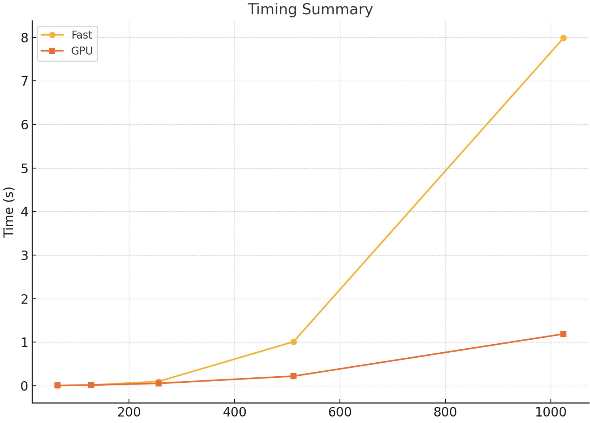

# MiniTorch Module 3


* Docs: https://minitorch.github.io/

* Overview: https://minitorch.github.io/module3.html


You will need to modify `tensor_functions.py` slightly in this assignment.

* Tests:

```
python run_tests.py
```

* Note:

Several of the tests for this assignment will only run if you are on a GPU machine and will not
run on github's test infrastructure. Please follow the instructions to setup up a colab machine
to run these tests.

This assignment requires the following files from the previous assignments. You can get these by running

```bash
python sync_previous_module.py previous-module-dir current-module-dir
```

The files that will be synced are:

        minitorch/tensor_data.py minitorch/tensor_functions.py minitorch/tensor_ops.py minitorch/operators.py minitorch/scalar.py minitorch/scalar_functions.py minitorch/module.py minitorch/autodiff.py minitorch/module.py project/run_manual.py project/run_scalar.py project/run_tensor.py minitorch/operators.py minitorch/module.py minitorch/autodiff.py minitorch/tensor.py minitorch/datasets.py minitorch/testing.py minitorch/optim.py

# Mod 3.1/3.2 Parallel Check Output

MAP

================================================================================
 Parallel Accelerator Optimizing:  Function tensor_map.<locals>._map,
/Users/anpandoh/Documents/CS5781/MiniTorch/mod3-Anpandoh/minitorch/fast_ops.py
(164)
================================================================================


Parallel loop listing for  Function tensor_map.<locals>._map, /Users/anpandoh/Documents/CS5781/MiniTorch/mod3-Anpandoh/minitorch/fast_ops.py (164)
---------------------------------------------------------------------------|loop #ID
    def _map(                                                              |
        out: Storage,                                                      |
        out_shape: Shape,                                                  |
        out_strides: Strides,                                              |
        in_storage: Storage,                                               |
        in_shape: Shape,                                                   |
        in_strides: Strides,                                               |
    ) -> None:                                                             |
        # parallelize the loop                                             |
        # out_index = np.zeros(len(out_shape), dtype=int)                  |
        # in_index = np.zeros(len(in_shape), dtype=int)                    |
                                                                           |
        # for i in range(len(out)):                                        |
        #     to_index(i, out_shape, out_index)                            |
        #     broadcast_index(out_index, out_shape, in_shape, in_index)    |
                                                                           |
        #     out_pos = index_to_position(out_index, out_strides)          |
        #     in_pos = index_to_position(in_index, in_strides)             |
        #     out[out_pos] = fn(in_storage[in_pos])                        |
                                                                           |
        for i in prange(len(out)):  # this is very similar to openMP-------| #0
            out_index = np.empty(len(out_shape), dtype=np.int32)           |
            in_index = np.empty(len(in_shape), dtype=np.int32)             |
            to_index(i, out_shape, out_index)                              |
            broadcast_index(out_index, out_shape, in_shape, in_index)      |
                                                                           |
            out_pos = index_to_position(out_index, out_strides)            |
            in_pos = index_to_position(in_index, in_strides)               |
            out[out_pos] = fn(in_storage[in_pos])                          |
--------------------------------- Fusing loops ---------------------------------
Attempting fusion of parallel loops (combines loops with similar properties)...
Following the attempted fusion of parallel for-loops there are 1 parallel for-
loop(s) (originating from loops labelled: #0).
--------------------------------------------------------------------------------
----------------------------- Before Optimisation ------------------------------
--------------------------------------------------------------------------------
------------------------------ After Optimisation ------------------------------
Parallel structure is already optimal.
--------------------------------------------------------------------------------
--------------------------------------------------------------------------------

---------------------------Loop invariant code motion---------------------------
Allocation hoisting:
The memory allocation derived from the instruction at
/Users/anpandoh/Documents/CS5781/MiniTorch/mod3-Anpandoh/minitorch/fast_ops.py
(185) is hoisted out of the parallel loop labelled #0 (it will be performed
before the loop is executed and reused inside the loop):
   Allocation:: out_index = np.empty(len(out_shape), dtype=np.int32)
    - numpy.empty() is used for the allocation.
The memory allocation derived from the instruction at
/Users/anpandoh/Documents/CS5781/MiniTorch/mod3-Anpandoh/minitorch/fast_ops.py
(186) is hoisted out of the parallel loop labelled #0 (it will be performed
before the loop is executed and reused inside the loop):
   Allocation:: in_index = np.empty(len(in_shape), dtype=np.int32)
    - numpy.empty() is used for the allocation.
None
ZIP

================================================================================
 Parallel Accelerator Optimizing:  Function tensor_zip.<locals>._zip,
/Users/anpandoh/Documents/CS5781/MiniTorch/mod3-Anpandoh/minitorch/fast_ops.py
(221)
================================================================================


Parallel loop listing for  Function tensor_zip.<locals>._zip, /Users/anpandoh/Documents/CS5781/MiniTorch/mod3-Anpandoh/minitorch/fast_ops.py (221)
-------------------------------------------------------------------------|loop #ID
    def _zip(                                                            |
        out: Storage,                                                    |
        out_shape: Shape,                                                |
        out_strides: Strides,                                            |
        a_storage: Storage,                                              |
        a_shape: Shape,                                                  |
        a_strides: Strides,                                              |
        b_storage: Storage,                                              |
        b_shape: Shape,                                                  |
        b_strides: Strides,                                              |
    ) -> None:                                                           |
        # parallelize the loop                                           |
        # out_index = np.zeros(len(out_shape), dtype=int)                |
        # a_index = np.zeros(len(a_shape), dtype=int)                    |
        # b_index = np.zeros(len(b_shape), dtype=int)                    |
                                                                         |
        # for i in range(len(out)):                                      |
        #     to_index(i, out_shape, out_index)                          |
        #     broadcast_index(out_index, out_shape, a_shape, a_index)    |
        #     broadcast_index(out_index, out_shape, b_shape, b_index)    |
                                                                         |
        #     out_pos = index_to_position(out_index, out_strides)        |
        #     a_pos = index_to_position(a_index, a_strides)              |
        #     b_pos = index_to_position(b_index, b_strides)              |
        #     out[out_pos] = fn(a_storage[a_pos], b_storage[b_pos])      |
        for i in prange(len(out)):---------------------------------------| #1
            out_index = np.empty(len(out_shape), dtype=np.int32)         |
            a_index = np.empty(len(a_shape), dtype=np.int32)             |
            b_index = np.empty(len(b_shape), dtype=np.int32)             |
            to_index(i, out_shape, out_index)                            |
            broadcast_index(out_index, out_shape, a_shape, a_index)      |
            broadcast_index(out_index, out_shape, b_shape, b_index)      |
                                                                         |
            out_pos = index_to_position(out_index, out_strides)          |
            a_pos = index_to_position(a_index, a_strides)                |
            b_pos = index_to_position(b_index, b_strides)                |
            out[out_pos] = fn(a_storage[a_pos], b_storage[b_pos])        |
--------------------------------- Fusing loops ---------------------------------
Attempting fusion of parallel loops (combines loops with similar properties)...
Following the attempted fusion of parallel for-loops there are 1 parallel for-
loop(s) (originating from loops labelled: #1).
--------------------------------------------------------------------------------
----------------------------- Before Optimisation ------------------------------
--------------------------------------------------------------------------------
------------------------------ After Optimisation ------------------------------
Parallel structure is already optimal.
--------------------------------------------------------------------------------
--------------------------------------------------------------------------------

---------------------------Loop invariant code motion---------------------------
Allocation hoisting:
The memory allocation derived from the instruction at
/Users/anpandoh/Documents/CS5781/MiniTorch/mod3-Anpandoh/minitorch/fast_ops.py
(247) is hoisted out of the parallel loop labelled #1 (it will be performed
before the loop is executed and reused inside the loop):
   Allocation:: out_index = np.empty(len(out_shape), dtype=np.int32)
    - numpy.empty() is used for the allocation.
The memory allocation derived from the instruction at
/Users/anpandoh/Documents/CS5781/MiniTorch/mod3-Anpandoh/minitorch/fast_ops.py
(248) is hoisted out of the parallel loop labelled #1 (it will be performed
before the loop is executed and reused inside the loop):
   Allocation:: a_index = np.empty(len(a_shape), dtype=np.int32)
    - numpy.empty() is used for the allocation.
The memory allocation derived from the instruction at
/Users/anpandoh/Documents/CS5781/MiniTorch/mod3-Anpandoh/minitorch/fast_ops.py
(249) is hoisted out of the parallel loop labelled #1 (it will be performed
before the loop is executed and reused inside the loop):
   Allocation:: b_index = np.empty(len(b_shape), dtype=np.int32)
    - numpy.empty() is used for the allocation.
None
REDUCE

================================================================================
 Parallel Accelerator Optimizing:  Function tensor_reduce.<locals>._reduce,
/Users/anpandoh/Documents/CS5781/MiniTorch/mod3-Anpandoh/minitorch/fast_ops.py
(284)
================================================================================


Parallel loop listing for  Function tensor_reduce.<locals>._reduce, /Users/anpandoh/Documents/CS5781/MiniTorch/mod3-Anpandoh/minitorch/fast_ops.py (284)
----------------------------------------------------------------------------------------|loop #ID
    def _reduce(                                                                        |
        out: Storage,                                                                   |
        out_shape: Shape,                                                               |
        out_strides: Strides,                                                           |
        a_storage: Storage,                                                             |
        a_shape: Shape,                                                                 |
        a_strides: Strides,                                                             |
        reduce_dim: int,                                                                |
    ) -> None:                                                                          |
        # parallelize the loop                                                          |
        # out_index = np.zeros(len(out_shape), dtype=int)                               |
        # for i in range(len(out)):                                                     |
        #     to_index(i, out_shape, out_index)                                         |
        #     out_pos = index_to_position(out_index, out_strides)                       |
                                                                                        |
        #     for j in range(a_shape[reduce_dim]):                                      |
        #         a_index = out_index.copy()                                            |
        #         a_index[reduce_dim] = j                                               |
        #         out[out_pos] = fn(                                                    |
        #             out[out_pos], a_storage[index_to_position(a_index, a_strides)]    |
        #         )                                                                     |
                                                                                        |
        # modified based off mod 2 answers                                              |
        for i in prange(len(out)):------------------------------------------------------| #3
            out_index: Index = np.zeros(MAX_DIMS, dtype=np.int32)-----------------------| #2
            reduce_size = a_shape[reduce_dim]                                           |
            to_index(i, out_shape, out_index)                                           |
            out_pos = index_to_position(out_index, out_strides)                         |
            # reduction                                                                 |
            for j in range(reduce_size):                                                |
                out_index[reduce_dim] = j                                               |
                j = index_to_position(out_index, a_strides)                             |
                out[out_pos] = fn(out[out_pos], a_storage[j])                           |
--------------------------------- Fusing loops ---------------------------------
Attempting fusion of parallel loops (combines loops with similar properties)...
Following the attempted fusion of parallel for-loops there are 2 parallel for-
loop(s) (originating from loops labelled: #3, #2).
--------------------------------------------------------------------------------
---------------------------- Optimising loop nests -----------------------------
Attempting loop nest rewrites (optimising for the largest parallel loops)...

+--3 is a parallel loop
   +--2 --> rewritten as a serial loop
--------------------------------------------------------------------------------
----------------------------- Before Optimisation ------------------------------
Parallel region 0:
+--3 (parallel)
   +--2 (parallel)


--------------------------------------------------------------------------------
------------------------------ After Optimisation ------------------------------
Parallel region 0:
+--3 (parallel)
   +--2 (serial)


Parallel region 0 (loop #3) had 0 loop(s) fused and 1 loop(s) serialized as part
 of the larger parallel loop (#3).
--------------------------------------------------------------------------------
--------------------------------------------------------------------------------

---------------------------Loop invariant code motion---------------------------
Allocation hoisting:
The memory allocation derived from the instruction at
/Users/anpandoh/Documents/CS5781/MiniTorch/mod3-Anpandoh/minitorch/fast_ops.py
(308) is hoisted out of the parallel loop labelled #3 (it will be performed
before the loop is executed and reused inside the loop):
   Allocation:: out_index: Index = np.zeros(MAX_DIMS, dtype=np.int32)
    - numpy.empty() is used for the allocation.
None
MATRIX MULTIPLY

================================================================================
 Parallel Accelerator Optimizing:  Function _tensor_matrix_multiply,
/Users/anpandoh/Documents/CS5781/MiniTorch/mod3-Anpandoh/minitorch/fast_ops.py
(322)
================================================================================


Parallel loop listing for  Function _tensor_matrix_multiply, /Users/anpandoh/Documents/CS5781/MiniTorch/mod3-Anpandoh/minitorch/fast_ops.py (322)
---------------------------------------------------------------------------------------|loop #ID
def _tensor_matrix_multiply(                                                           |
    out: Storage,                                                                      |
    out_shape: Shape,                                                                  |
    out_strides: Strides,                                                              |
    a_storage: Storage,                                                                |
    a_shape: Shape,                                                                    |
    a_strides: Strides,                                                                |
    b_storage: Storage,                                                                |
    b_shape: Shape,                                                                    |
    b_strides: Strides,                                                                |
) -> None:                                                                             |
    """NUMBA tensor matrix multiply function.                                          |
                                                                                       |
    Should work for any tensor shapes that broadcast as long as                        |
                                                                                       |
    ```                                                                                |
    assert a_shape[-1] == b_shape[-2]                                                  |
    ```                                                                                |
                                                                                       |
    Optimizations:                                                                     |
                                                                                       |
    * Outer loop in parallel                                                           |
    * No index buffers or function calls                                               |
    * Inner loop should have no global writes, 1 multiply.                             |
                                                                                       |
                                                                                       |
    Args:                                                                              |
    ----                                                                               |
        out (Storage): storage for `out` tensor                                        |
        out_shape (Shape): shape for `out` tensor                                      |
        out_strides (Strides): strides for `out` tensor                                |
        a_storage (Storage): storage for `a` tensor                                    |
        a_shape (Shape): shape for `a` tensor                                          |
        a_strides (Strides): strides for `a` tensor                                    |
        b_storage (Storage): storage for `b` tensor                                    |
        b_shape (Shape): shape for `b` tensor                                          |
        b_strides (Strides): strides for `b` tensor                                    |
                                                                                       |
    Returns:                                                                           |
    -------                                                                            |
        None : Fills in `out`                                                          |
                                                                                       |
    """                                                                                |
    a_batch_stride = a_strides[0] if a_shape[0] > 1 else 0                             |
    b_batch_stride = b_strides[0] if b_shape[0] > 1 else 0                             |
                                                                                       |
    for i in prange(out_shape[0]):-----------------------------------------------------| #4
        for j in range(out_shape[1]):                                                  |
            for k in range(out_shape[2]):                                              |
                # private vars                                                         |
                a_index = i * a_batch_stride + j * a_strides[1]                        |
                b_index = i * b_batch_stride + k * b_strides[2]                        |
                res = 0.0                                                              |
                # loop through the 3rd dimension                                       |
                for _ in range(a_shape[2]):                                            |
                    res += a_storage[a_index] * b_storage[b_index]  # sum reduction    |
                    a_index += a_strides[2]  # sum reduction                           |
                    b_index += b_strides[1]  # sum reduction                           |
                                                                                       |
                output_index = (                                                       |
                    i * out_strides[0] + j * out_strides[1] + k * out_strides[2]       |
                )                                                                      |
                out[output_index] = res                                                |
--------------------------------- Fusing loops ---------------------------------
Attempting fusion of parallel loops (combines loops with similar properties)...
Following the attempted fusion of parallel for-loops there are 1 parallel for-
loop(s) (originating from loops labelled: #4).
--------------------------------------------------------------------------------
----------------------------- Before Optimisation ------------------------------
--------------------------------------------------------------------------------
------------------------------ After Optimisation ------------------------------
Parallel structure is already optimal.
--------------------------------------------------------------------------------
--------------------------------------------------------------------------------

---------------------------Loop invariant code motion---------------------------
Allocation hoisting:
No allocation hoisting found
None


# Mod 3.4 Graph

Timing summary
Size: 64
    fast: 0.00471
    gpu: 0.00632
Size: 128
    fast: 0.01624
    gpu: 0.01460
Size: 256
    fast: 0.09766
    gpu: 0.05393
Size: 512
    fast: 1.01107
    gpu: 0.22005
Size: 1024
    fast: 7.98512
    gpu: 1.18902




# Mod 3.5 Training

## 100 Hidden Layers

### Simple

Total Time: 11 min 41 seconds       Average Time: 1.402 seconds


Epoch  0  loss  5.021117719117644 correct 46
Epoch  10  loss  2.2130826527055727 correct 47
Epoch  20  loss  1.4486699453908263 correct 49
Epoch  30  loss  1.6012359186112202 correct 49
Epoch  40  loss  0.7089700791010412 correct 49
Epoch  50  loss  1.2510776149545446 correct 49
Epoch  60  loss  1.0116661099154542 correct 50
Epoch  70  loss  1.5281042964094262 correct 50
Epoch  80  loss  0.5773450563386824 correct 49
Epoch  90  loss  1.1937383691769783 correct 49
Epoch  100  loss  0.1877153597703799 correct 49
Epoch  110  loss  0.8274261778489262 correct 49
Epoch  120  loss  1.9429403086364103 correct 49
Epoch  130  loss  1.1202739014068208 correct 49
Epoch  140  loss  0.2941002079389854 correct 50
Epoch  150  loss  0.261298335931121 correct 49
Epoch  160  loss  0.1483870717536495 correct 49
Epoch  170  loss  0.5781457311926514 correct 49
Epoch  180  loss  1.1368508503608967 correct 49
Epoch  190  loss  0.15711203101849777 correct 49
Epoch  200  loss  0.5623079639363586 correct 49
Epoch  210  loss  0.5295447406445419 correct 49
Epoch  220  loss  1.0677776632269353 correct 50
Epoch  230  loss  0.064715957392493 correct 49
Epoch  240  loss  0.19892415297150268 correct 49
Epoch  250  loss  0.16186931228670526 correct 49
Epoch  260  loss  0.8109348044537597 correct 49
Epoch  270  loss  0.1028254864632867 correct 50
Epoch  280  loss  0.36442689270045836 correct 49
Epoch  290  loss  0.008835690178751378 correct 49
Epoch  300  loss  0.4279965402931033 correct 49
Epoch  310  loss  0.2055757206442485 correct 50
Epoch  320  loss  0.9390485341474277 correct 50
Epoch  330  loss  0.8747500210467374 correct 49
Epoch  340  loss  0.3391469718348396 correct 49
Epoch  350  loss  1.1701986235081039 correct 49
Epoch  360  loss  0.006032465918531538 correct 49
Epoch  370  loss  0.10695448907361563 correct 50
Epoch  380  loss  0.0012185930504904825 correct 49
Epoch  390  loss  0.19002467674958112 correct 50
Epoch  400  loss  0.010087258175850624 correct 49
Epoch  410  loss  1.232609665939735 correct 50
Epoch  420  loss  0.860494979264757 correct 49
Epoch  430  loss  0.9667618476877661 correct 50
Epoch  440  loss  0.3814130338178274 correct 49
Epoch  450  loss  0.3730177223920873 correct 49
Epoch  460  loss  0.9554843933247293 correct 50
Epoch  470  loss  0.006142820336495202 correct 49
Epoch  480  loss  0.4549123195350478 correct 49
Epoch  490  loss  0.016956196677134012 correct 50

### Split

Total Time: 11 min 36 second       Average Time: 1.392 seconds


Epoch  0  loss  4.974794323511812 correct 32
Epoch  10  loss  4.866075460767081 correct 42
Epoch  20  loss  4.452935023908912 correct 39
Epoch  30  loss  3.1204575954818154 correct 45
Epoch  40  loss  3.0979522578514453 correct 45
Epoch  50  loss  3.6281284983105166 correct 43
Epoch  60  loss  2.0102994763035102 correct 49
Epoch  70  loss  1.4664962610995271 correct 45
Epoch  80  loss  2.502620995539208 correct 49
Epoch  90  loss  1.9281485980573676 correct 47
Epoch  100  loss  2.1940869274636503 correct 48
Epoch  110  loss  1.4787541646757865 correct 48
Epoch  120  loss  1.263647801778647 correct 46
Epoch  130  loss  1.56677790718257 correct 48
Epoch  140  loss  1.541647698848383 correct 48
Epoch  150  loss  0.6923766414914844 correct 48
Epoch  160  loss  0.6565255024502188 correct 50
Epoch  170  loss  2.2846881030895165 correct 49
Epoch  180  loss  1.0463522898450472 correct 47
Epoch  190  loss  1.7577502943582035 correct 47
Epoch  200  loss  0.48397059958641936 correct 49
Epoch  210  loss  0.7976809402579368 correct 50
Epoch  220  loss  1.578133567601871 correct 48
Epoch  230  loss  1.3979002091224177 correct 48
Epoch  240  loss  0.8768089165576034 correct 50
Epoch  250  loss  1.3648225503378946 correct 49
Epoch  260  loss  1.0507172044004411 correct 49
Epoch  270  loss  0.5174502356925563 correct 49
Epoch  280  loss  2.6861209662365777 correct 46
Epoch  290  loss  0.4929772493288891 correct 50
Epoch  300  loss  0.6117936196462845 correct 50
Epoch  310  loss  0.7393048548177391 correct 49
Epoch  320  loss  0.21943784103150327 correct 48
Epoch  330  loss  0.6260285714803779 correct 49
Epoch  340  loss  1.0187334353429216 correct 50
Epoch  350  loss  1.2429499913593505 correct 50
Epoch  360  loss  0.603376963453909 correct 48
Epoch  370  loss  0.18490361660506321 correct 49
Epoch  380  loss  0.8290414637159247 correct 49
Epoch  390  loss  0.14173384587725787 correct 49
Epoch  400  loss  0.49109535557611866 correct 49
Epoch  410  loss  0.23736286859093544 correct 50
Epoch  420  loss  1.070753109734983 correct 50
Epoch  430  loss  1.3995939776911388 correct 49
Epoch  440  loss  0.04876306614577331 correct 50
Epoch  450  loss  1.612705599942421 correct 49
Epoch  460  loss  0.37252833317744816 correct 49
Epoch  470  loss  0.033039545749305836 correct 50
Epoch  480  loss  0.35616778821366085 correct 50
Epoch  490  loss  0.5197568422011701 correct 49

### XOR

Total Time: 11 min 34 seconds       Average Time: 1.388 seconds

Epoch  0  loss  6.764605472673965 correct 34
Epoch  10  loss  5.913263957041755 correct 41
Epoch  20  loss  5.204119858833385 correct 42
Epoch  30  loss  3.175175500679197 correct 43
Epoch  40  loss  5.386119967846439 correct 46
Epoch  50  loss  2.7435624847807376 correct 44
Epoch  60  loss  2.895999756358454 correct 44
Epoch  70  loss  2.9135403565622813 correct 44
Epoch  80  loss  1.6710988001173146 correct 44
Epoch  90  loss  1.775379186641775 correct 48
Epoch  100  loss  3.122077413150103 correct 48
Epoch  110  loss  1.666772848068336 correct 49
Epoch  120  loss  0.9362277398004752 correct 49
Epoch  130  loss  2.6170149219613625 correct 47
Epoch  140  loss  2.673351174159797 correct 48
Epoch  150  loss  2.727446354823298 correct 49
Epoch  160  loss  1.4992308194328485 correct 49
Epoch  170  loss  1.7208755675874863 correct 50
Epoch  180  loss  1.8014910768175856 correct 50
Epoch  190  loss  1.266328684600353 correct 50
Epoch  200  loss  1.917086543766721 correct 50
Epoch  210  loss  1.3014378219279898 correct 50
Epoch  220  loss  1.7460568070681566 correct 50
Epoch  230  loss  1.1207904382415648 correct 50
Epoch  240  loss  0.43796745139727367 correct 50
Epoch  250  loss  0.6107759072100943 correct 49
Epoch  260  loss  0.7247489804464256 correct 50
Epoch  270  loss  1.0011055516952487 correct 50
Epoch  280  loss  0.9408964477362269 correct 49
Epoch  290  loss  1.7117006623882278 correct 49
Epoch  300  loss  1.142124225085328 correct 50
Epoch  310  loss  0.39475577441226745 correct 50
Epoch  320  loss  0.9960288157252686 correct 50
Epoch  330  loss  0.5642312483765679 correct 50
Epoch  340  loss  0.27383139631746733 correct 49
Epoch  350  loss  1.293975300829945 correct 50
Epoch  360  loss  0.9924389965248838 correct 50
Epoch  370  loss  0.6313809729328972 correct 50
Epoch  380  loss  0.7440098651775249 correct 50
Epoch  390  loss  0.28599232985904166 correct 50
Epoch  400  loss  0.18631168284904503 correct 50
Epoch  410  loss  0.6122520492166857 correct 50
Epoch  420  loss  0.3782444924130708 correct 50
Epoch  430  loss  0.2534213944262367 correct 50
Epoch  440  loss  0.34481598098528504 correct 50
Epoch  450  loss  0.3972605242870362 correct 50
Epoch  460  loss  0.3218059497901668 correct 50
Epoch  470  loss  0.34762023065924696 correct 50
Epoch  480  loss  0.1535732282802127 correct 50
Epoch  490  loss  0.09017544670889063 correct 50


## 200 Hidden Layers

### Simple

Total Time: 16 min 57 seconds       Average Time: 2.034 seconds

Epoch  0  loss  0.9411049019855656 correct 43
Epoch  10  loss  0.08836650600698046 correct 47
Epoch  20  loss  0.48246284732433653 correct 46
Epoch  30  loss  2.128077740617218 correct 50
Epoch  40  loss  0.7843997365401097 correct 48
Epoch  50  loss  0.2154933522468053 correct 50
Epoch  60  loss  3.439908040233961 correct 43
Epoch  70  loss  0.19655526811715163 correct 50
Epoch  80  loss  0.4911973690242576 correct 48
Epoch  90  loss  0.441830102435667 correct 48
Epoch  100  loss  0.5514052367891058 correct 48
Epoch  110  loss  0.10884248729321024 correct 50
Epoch  120  loss  1.960809091959287 correct 48
Epoch  130  loss  0.6351406459640837 correct 50
Epoch  140  loss  0.2610098451709737 correct 49
Epoch  150  loss  0.19032185363422055 correct 50
Epoch  160  loss  0.7622495745226634 correct 48
Epoch  170  loss  0.6828251682367072 correct 50
Epoch  180  loss  0.019056523166351234 correct 49
Epoch  190  loss  0.15953975304393095 correct 50
Epoch  200  loss  0.1804805170391713 correct 50
Epoch  210  loss  0.6015216336704001 correct 50
Epoch  220  loss  0.7564395647093312 correct 50
Epoch  230  loss  0.17977775914957692 correct 48
Epoch  240  loss  0.30899991782647146 correct 49
Epoch  250  loss  0.011141042188095168 correct 50
Epoch  260  loss  0.5575503483680169 correct 50
Epoch  270  loss  0.4409063317995188 correct 50
Epoch  280  loss  0.21726099908773122 correct 50
Epoch  290  loss  0.06925881995477905 correct 50
Epoch  300  loss  0.6192059714775933 correct 50
Epoch  310  loss  0.7560266236180742 correct 50
Epoch  320  loss  0.4927800784824698 correct 50
Epoch  330  loss  0.16643485204388506 correct 49
Epoch  340  loss  0.06741907638651388 correct 50
Epoch  350  loss  0.5818442744692804 correct 50
Epoch  360  loss  0.3611951815565019 correct 50
Epoch  370  loss  0.02996590423229845 correct 50
Epoch  380  loss  0.19761841944025765 correct 50
Epoch  390  loss  0.507070380030618 correct 50
Epoch  400  loss  0.015024355067992115 correct 50
Epoch  410  loss  0.17786476929479728 correct 50
Epoch  420  loss  0.004754193616109324 correct 50
Epoch  430  loss  0.45893030578258964 correct 50
Epoch  440  loss  0.6143199620161904 correct 50
Epoch  450  loss  0.15530543435591843 correct 50
Epoch  460  loss  0.33680032014106837 correct 50
Epoch  470  loss  0.26101584534951244 correct 50
Epoch  480  loss  0.057860464008584904 correct 50
Epoch  490  loss  0.16436485761836625 correct 50

### Split

Total Time: 16 minutes 55 seconds       Average Time: 2.03 seconds

Epoch  0  loss  8.441662459835193 correct 19
Epoch  10  loss  2.744967442322891 correct 45
Epoch  20  loss  3.2057189005634044 correct 48
Epoch  30  loss  3.755767941314237 correct 46
Epoch  40  loss  2.4173598155037226 correct 43
Epoch  50  loss  1.6653458371662433 correct 47
Epoch  60  loss  1.406173886533955 correct 47
Epoch  70  loss  1.9202527659546291 correct 50
Epoch  80  loss  1.8411591801881153 correct 50
Epoch  90  loss  0.47422640834067253 correct 48
Epoch  100  loss  1.5300471494602879 correct 49
Epoch  110  loss  1.1799942317056409 correct 48
Epoch  120  loss  2.0731203303377983 correct 49
Epoch  130  loss  2.152621292899535 correct 48
Epoch  140  loss  1.0603955619973329 correct 50
Epoch  150  loss  1.7288626599748858 correct 50
Epoch  160  loss  0.27389248940916977 correct 49
Epoch  170  loss  1.2953425936475589 correct 49
Epoch  180  loss  0.2554694999916951 correct 50
Epoch  190  loss  0.5456360573086181 correct 50
Epoch  200  loss  0.28698266111302895 correct 50
Epoch  210  loss  0.6751557810284008 correct 50
Epoch  220  loss  0.9450240981882299 correct 50
Epoch  230  loss  0.6218492036395935 correct 50
Epoch  240  loss  0.2847284839226122 correct 50
Epoch  250  loss  0.9337311331495972 correct 50
Epoch  260  loss  0.6556710013182447 correct 50
Epoch  270  loss  0.4785089875029124 correct 50
Epoch  280  loss  0.6470802033533035 correct 50
Epoch  290  loss  0.43318154303186174 correct 50
Epoch  300  loss  0.35728853087279255 correct 50
Epoch  310  loss  0.4947470209633335 correct 50
Epoch  320  loss  0.16077501997090685 correct 50
Epoch  330  loss  0.285199159033323 correct 50
Epoch  340  loss  0.015240610906655783 correct 50
Epoch  350  loss  0.373106280794676 correct 50
Epoch  360  loss  0.14923576748181294 correct 50
Epoch  370  loss  0.30850816256627356 correct 50
Epoch  380  loss  0.2194092947728167 correct 50
Epoch  390  loss  0.25504707538488225 correct 50
Epoch  400  loss  0.2232208125178232 correct 50
Epoch  410  loss  0.021363291720528928 correct 50
Epoch  420  loss  0.04003654968739072 correct 50
Epoch  430  loss  0.01362866599307025 correct 50
Epoch  440  loss  0.02392949899824783 correct 50
Epoch  450  loss  0.24405564867688578 correct 50
Epoch  460  loss  0.05457527196950874 correct 50
Epoch  470  loss  0.25571654080613004 correct 50
Epoch  480  loss  0.035826867830741405 correct 50
Epoch  490  loss  0.02823944713977755 correct 50
### XOR

Total Time: 16 minutes 57 seconds       Average Time: 2.034 seconds

Epoch  0  loss  22.607379658907057 correct 38
Epoch  10  loss  5.863917460866881 correct 27
Epoch  20  loss  6.310919405488395 correct 41
Epoch  30  loss  1.7543737014728884 correct 46
Epoch  40  loss  1.352517040241994 correct 47
Epoch  50  loss  1.1401188972204481 correct 47
Epoch  60  loss  1.4197778835154953 correct 47
Epoch  70  loss  1.5192607389056154 correct 48
Epoch  80  loss  1.1864122241908603 correct 48
Epoch  90  loss  1.802175952349205 correct 49
Epoch  100  loss  0.4131049430842681 correct 47
Epoch  110  loss  0.5464972425695604 correct 49
Epoch  120  loss  0.8716958639505596 correct 49
Epoch  130  loss  0.7204897129121911 correct 48
Epoch  140  loss  1.4698852094654122 correct 50
Epoch  150  loss  0.840686439838767 correct 50
Epoch  160  loss  0.3646532224267818 correct 50
Epoch  170  loss  0.31402281414177224 correct 50
Epoch  180  loss  0.3051807198340959 correct 50
Epoch  190  loss  0.2433346436672865 correct 50
Epoch  200  loss  0.3514640527361576 correct 50
Epoch  210  loss  0.5861553658452566 correct 50
Epoch  220  loss  0.8736310117716521 correct 50
Epoch  230  loss  0.17695376153629896 correct 50
Epoch  240  loss  1.1877850404604882 correct 50
Epoch  250  loss  0.15734360538172726 correct 50
Epoch  260  loss  0.24789785605561773 correct 50
Epoch  270  loss  0.19459173742728453 correct 50
Epoch  280  loss  0.15825517170165795 correct 50
Epoch  290  loss  0.26877519209102735 correct 50
Epoch  300  loss  0.06782960001538813 correct 50
Epoch  310  loss  0.08013009116427215 correct 50
Epoch  320  loss  0.3496083424989026 correct 50
Epoch  330  loss  0.08544650640011102 correct 50
Epoch  340  loss  0.018131167453846717 correct 50
Epoch  350  loss  0.3524000948547921 correct 50
Epoch  360  loss  0.33742527378200576 correct 50
Epoch  370  loss  0.34576312180703583 correct 50
Epoch  380  loss  0.21204792500374342 correct 50
Epoch  390  loss  0.3086571032336861 correct 50
Epoch  400  loss  0.35187890053528315 correct 50
Epoch  410  loss  0.021222209875657313 correct 50
Epoch  420  loss  0.06655650286950392 correct 50
Epoch  430  loss  0.18212067549334754 correct 50
Epoch  440  loss  0.07085314015191915 correct 50
Epoch  450  loss  0.06262377681150474 correct 50
Epoch  460  loss  0.0806776111160422 correct 50
Epoch  470  loss  0.24330505227471622 correct 50
Epoch  480  loss  0.2831212275715635 correct 50
Epoch  490  loss  0.010537944696819082 correct 50